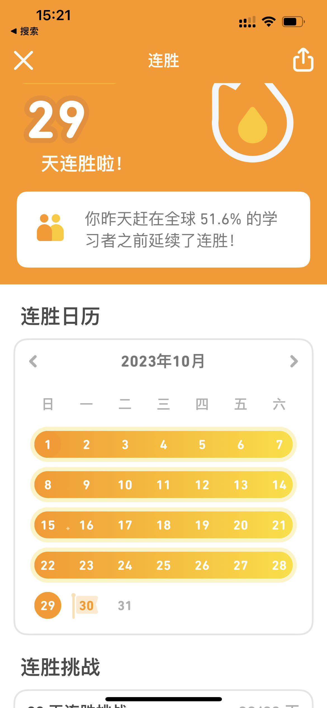

## 1、中国科幻作家海漄作品《时空画师》荣获雨果奖

10月21日晚，第81届雨果奖（Hugo Award）获奖名单正式揭晓，又一名中国科幻作家获此奖——海漄的作品[《时空画师》](https://book.douban.com/subject/35898128/)荣获最佳短中篇小说（Best Novelette），刘慈欣为海漄颁奖。

## 2、[创业公司 HeyGen](https://www.heygen.com/) 

这是一家利用AI技术做视频翻译的创业公司，先看2个视频感受一下他们的产品 [Speak any language](https://x.com/ColinandSamir/status/1715069836915814639?s=20) 、

[潘长江，这身高，只要拍出来，就是短视频](https://x.com/dotey/status/1716126479291920531?s=20)。

## 3、[人类幼崽有多搞笑](https://www.bilibili.com/video/BV1G8411y76w/?spm_id_from=333.1007.tianma.19-3-58.click&vd_source=3afcc36db719cf17067a572101ab4393)

人类幼崽有多搞笑，烦恼的时候看看这个，真的是巨减压！

<iframe width="640" height="360" src="https://www.bilibili.com/video/BV1G8411y76w/?spm_id_from=333.1007.tianma.19-3-58.click&vd_source=3afcc36db719cf17067a572101ab4393" frameborder="0" allowfullscreen></iframe>

## 4、[多邻国创始人专访](https://www.ruanyifeng.com/blog/2018/04/weekly-issue-1.html)

这是财经博主[小Lin说](https://www.youtube.com/@xiao_lin_shuo)做的一期专访，《专访多邻国创始人：从技术天才到全球第一语言APP，他真的很不一样》。采访内容还是挺不错的，我第一次看到这个采访是在国庆参加好兄弟婚礼的时候，看完以后立马下载了 APP 体验，确实很不错，然后我就开始了每天打卡，至今已有 29天。

[//]: # ""

## 5、管理书籍 [High Output Management](https://book.douban.com/subject/2997211//)

作者 [Andrew S. Grove](https://book.douban.com/author/4509401)，这本书不说大道理和哲学，直接告诉你这样做。中文版是 [格鲁夫给经理人的第一课](https://book.douban.com/subject/5431183/)，豆瓣9.1评分。

## 6、[唐巧的博客](https://blog.devtang.com/)

80 后，程序员。作为核心员工在 [猿辅导](https://www.yuanfudao.com/) 参与创业。曾作为产品技术负责人孵化了 [小猿搜题](https://www.yuansouti.com/) 和 [小猿口算](https://xiaoyuankousuan.com/)，现在作为负责人在孵化小斑斑月龄盒业务。

他的博客主要的内容包括 iOS 开发技巧、创业感悟、读书心得、产品研究笔记。

## 7、[泰国曼谷体验实弹射击](https://luolei.org/bangkok-shooting)

作者分享了他的体验实弹射击经历，博客内容很丰富，是一篇不错的攻略。

## 8、AI 代码生成工具 CodeWhisperer

[CodeWhisperer ](https://aws.amazon.com/cn/codewhisperer/)是亚马逊推出的一款代码辅助工具，官方称使用这款工具工作效率可提升 57%，可以去试用一下下。小师妹给出了[入坑攻略](https://www.bilibili.com/video/BV1QC4y1G7oa/?spm_id_from=333.1007.tianma.9-1-26.click&vd_source=3afcc36db719cf17067a572101ab4393)。

## 9、[生命之旅 | 西北大环线深度自驾游旅拍](https://www.bilibili.com/video/BV1Df4y1p7Ly/?spm_id_from=333.999.0.0&vd_source=3afcc36db719cf17067a572101ab4393)

作为一名程序员up主，小师妹可不止会编程哦，她的视频合集《在路上遇自己》拍的很好，本链接视频的结尾很惊艳哦(3'50''开始)。

每个人都不应该给自己设限，在路上遇见更好的自己。

## 10、[经历少，作品一定要足够多](https://www.bilibili.com/video/BV1nh4y1v7Ti/?spm_id_from=333.999.0.0&vd_source=3afcc36db719cf17067a572101ab4393)

这是一个采访，主人公是一个非常聪明的00后，分享了一些他为什么能拿到非常多的好的 offer 的经验。

